PullRequest 手順書

MKシステムで社内ルールを改善したいところを見つけたらPullRequest を作成して、議論を行います
以下が手順書です

gitが得意な人は勝手にやってください

=======================================

1. forkする

  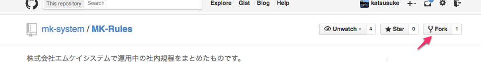

2. 所属している組織を選択(必要であれば)

  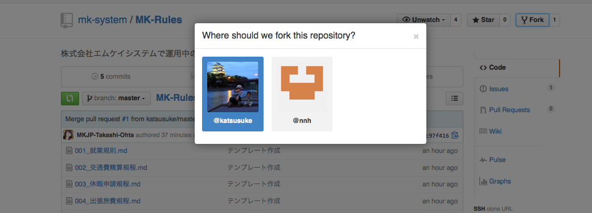

3. 変更したい規定を選択

  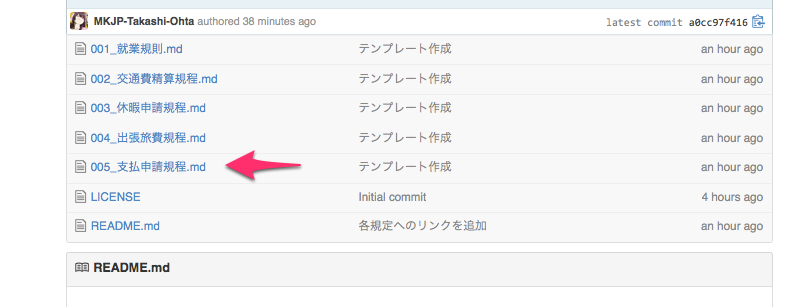

4. 編集をクリック

  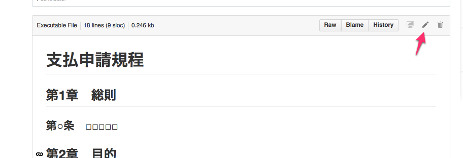

5. 変更する

  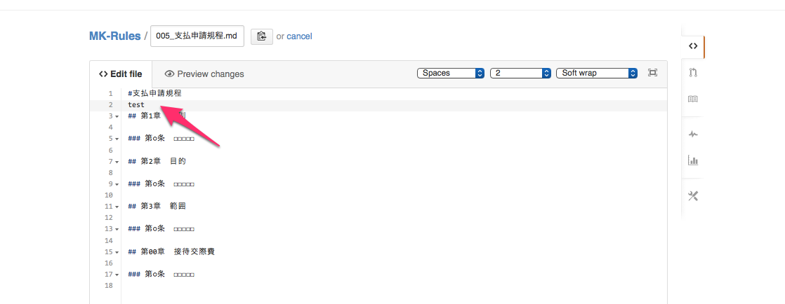

6. 変更内容をプレビューで確認

  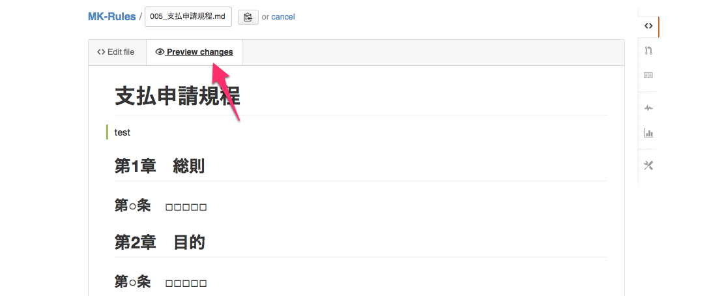

7. ページ下部で変更内容を記入してcommit

  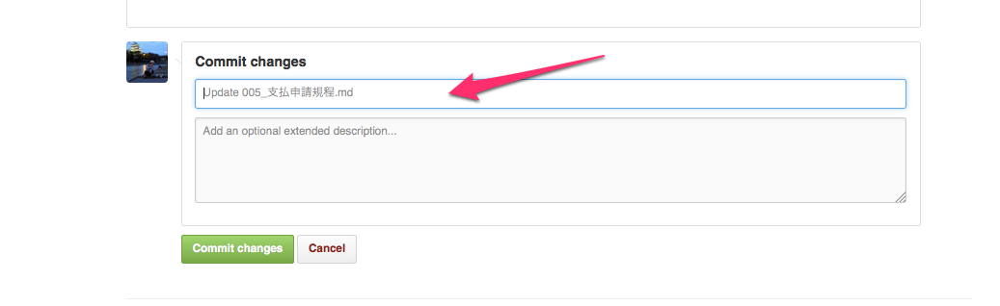

  例:
  ooのxxx を--- に変更した

  等完結で分かりやすい文章を心がけましょう
  補足点があれば下の欄に入力してください

8. レポジトリトップに戻る

  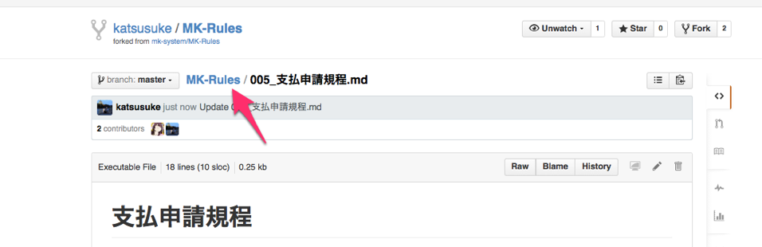

  複数のファイルを変更したい場合は、手順3 に戻ります。
  変更が完了したら手順9に進みます。

9. プルリクエスト作成画面に移動

  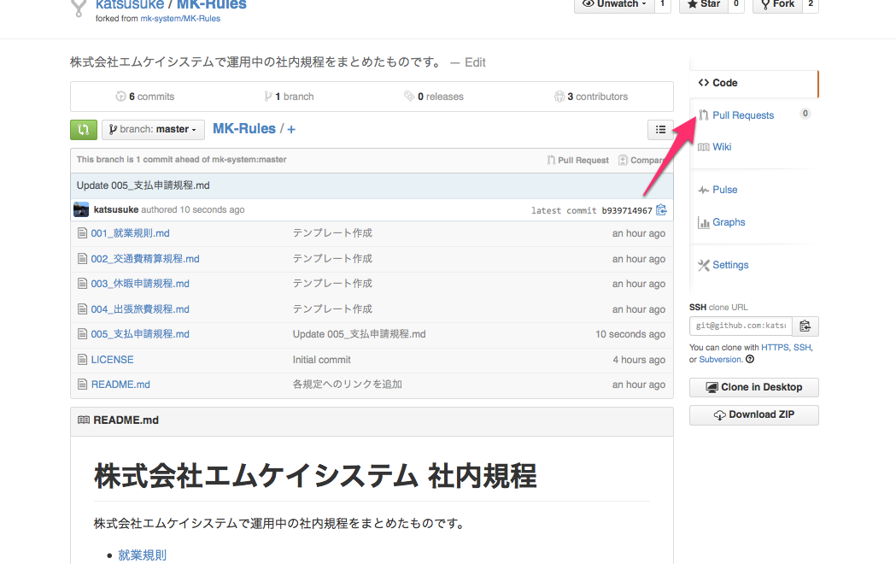
  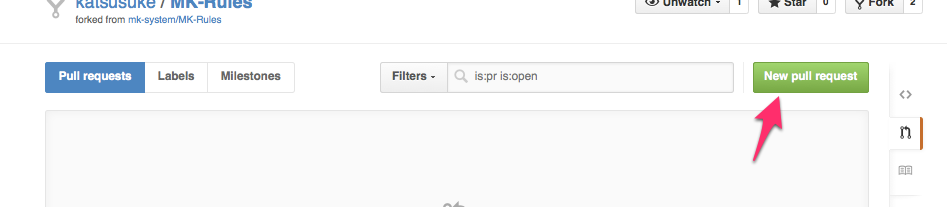

10. 変更内容が意図した内容であるかを確認

  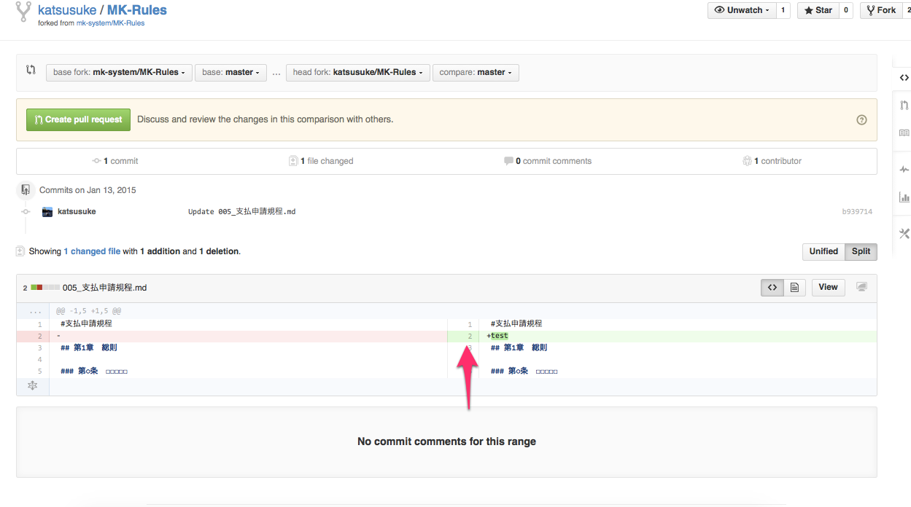

  意図しない変更の時は分かりそうな人を捕まえて聞いてください。

11. タイトルと変更内容の概要を記入

  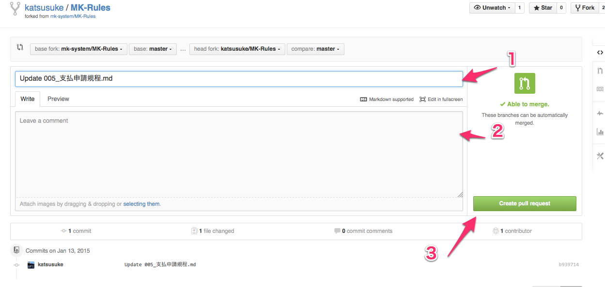

  1にはこの変更のタイトルを入力してください

  2には
  後から見た時に、その変更が
  - なぜ必要であったか？
  - どのように変更したか？

  等を簡潔に記載してください。

  内容の記載が終わったら3を押してください

12. 不要になったフォークの削除

  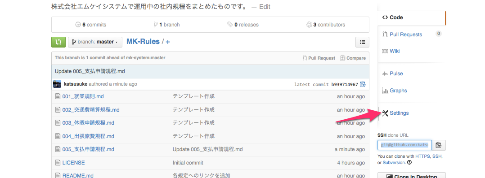
  Settings をクリックして
  
  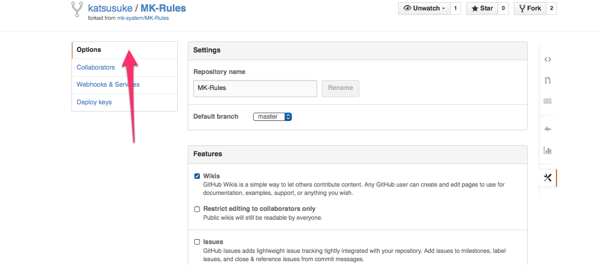

  Optionsページを下部にスクロールします

  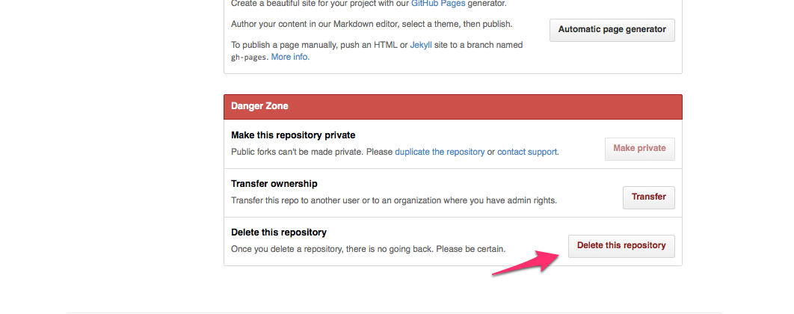

  Denger Zone のDelete this repository をクリック

  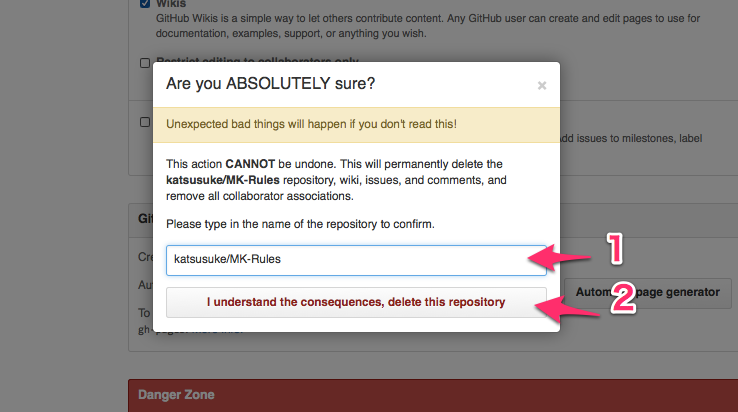

  1に アカウント名/MK-Rules を入力して

  2の I understand the consequences, delete this repositoryをクリックします

  ※管理者アカウントでやらないように

以上

